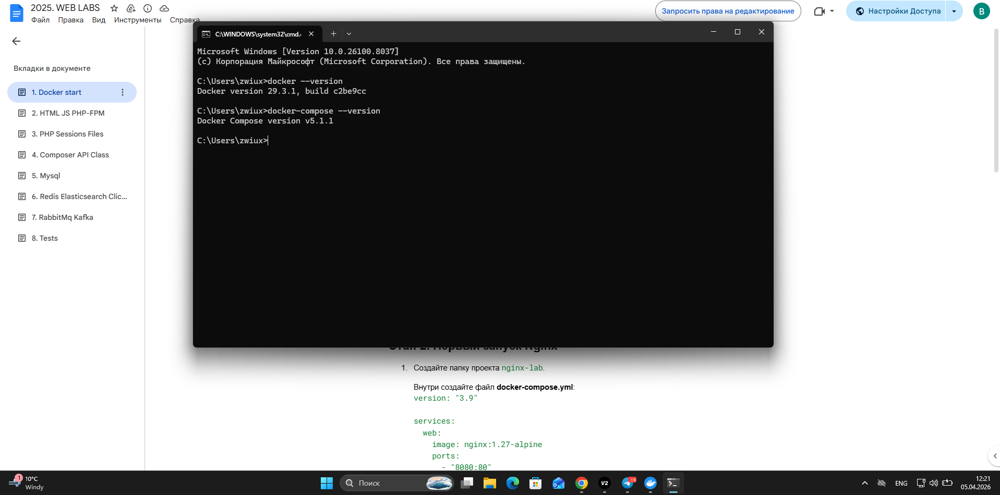
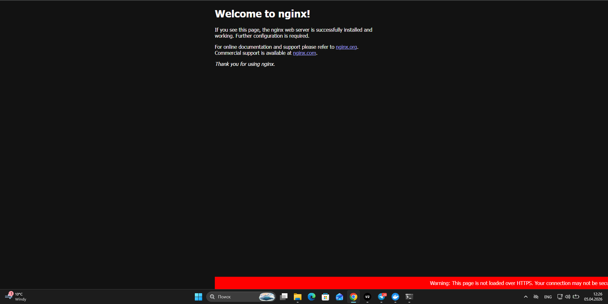
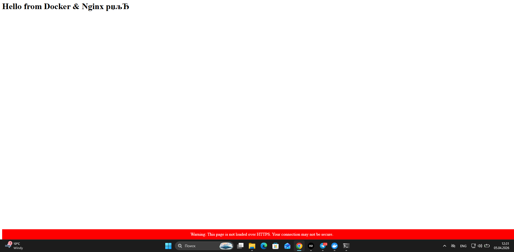
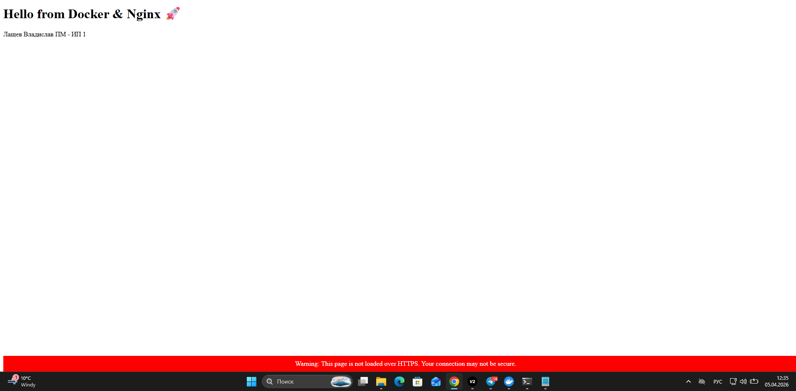
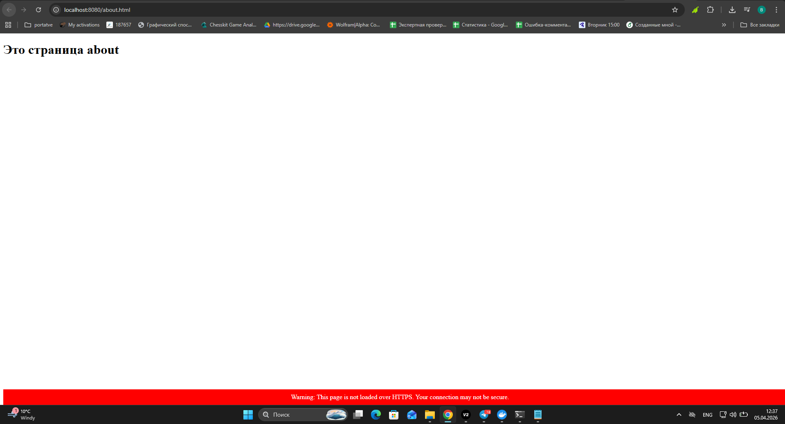
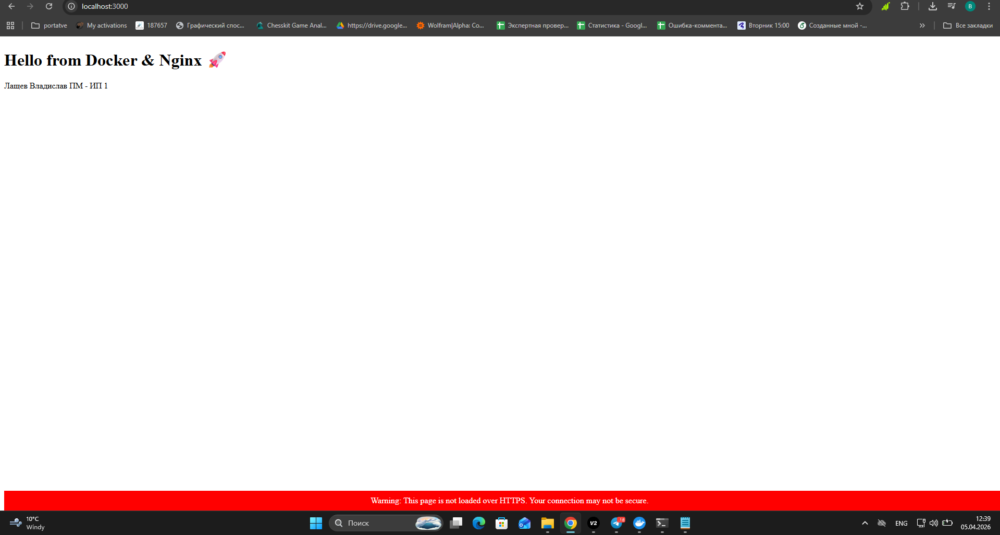

# Лабораторная работа №1: Nginx + Docker

**👩‍💻 Автор**
- **ФИО:** Лащев Владислав
- **Группа:** ПМ-ИП1

**📌 Описание задания**
Создать веб-сервер в Docker с использованием Nginx и подключить HTML-страницу.
Результат доступен по адресу http://localhost:3000.

**⚙️ Как запустить проект**
1. Клонировать репозиторий:
   ```bash
   git clone https://github.com/zwiuxo/WEB-Lab-1
   cd nginx-lab
   ```
2. Запустить контейнеры:
   ```bash
   docker-compose up -d --build
   ```
3. Открыть в браузере: http://localhost:3000

**📂 Содержимое проекта**
- `docker-compose.yml` — описание сервиса Nginx
- `code/index.html` — главная HTML-страница
- `screenshots/` — папка со скриншотами

## 📸 Скриншоты работы








**✅ Результат**
Сервер в Docker успешно запущен, Nginx отдаёт мою HTML-страницу.
